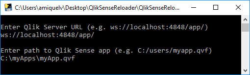
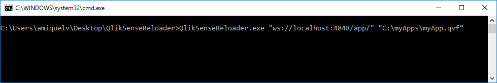

QlikSenseReloader
======
Reload Qlik Sense apps from the command line

Installation
------
Download QlikSenseReloader.exe.

Usage
------

### Interactive mode
1. Run QlikSenseReloader.exe
2. Enter the URL of the Qlik Sense Engine. For Qlik Sense Desktop, type `ws://localhost:4848/app/`.
3. Enter the full path to the Qlik Sense app you want to reload. For example, `C:\myApp.qvf`.

## Batch mode
1. Open Windows Command Prompt where QlikSenseReloader.exe is located.
2. Type ` QlikSenseReloader.exe "MyURL" "MyApp"` where 'MyURL' is the URL of the Qlik Sense Engine (for Qlik Sense Desktop, type `"ws://localhost:4848/app/"`) and `MyPath` is the full path to the Qlik Sense app you want to reload (e.g `"C:\myApp.qvf"`).

License
------
MIT
